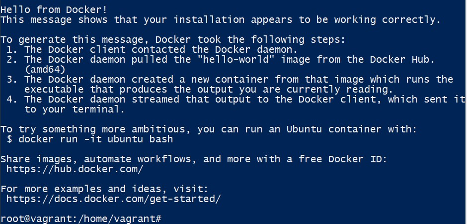
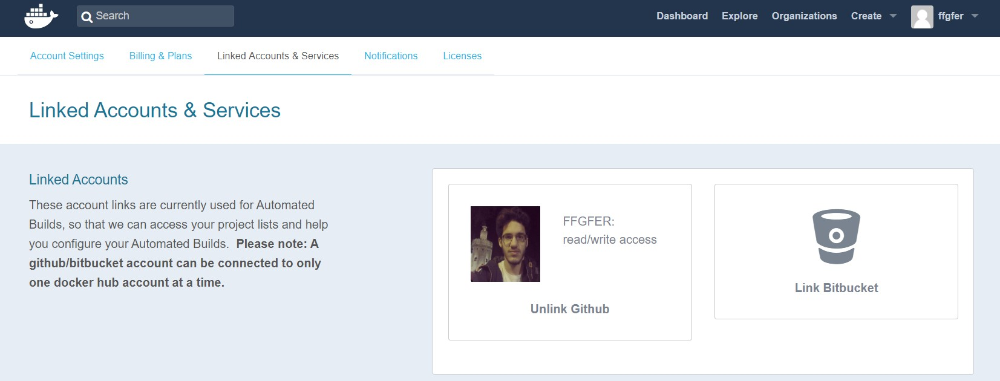
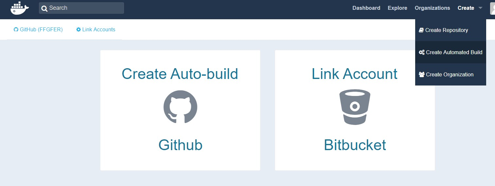
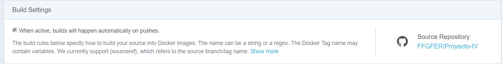
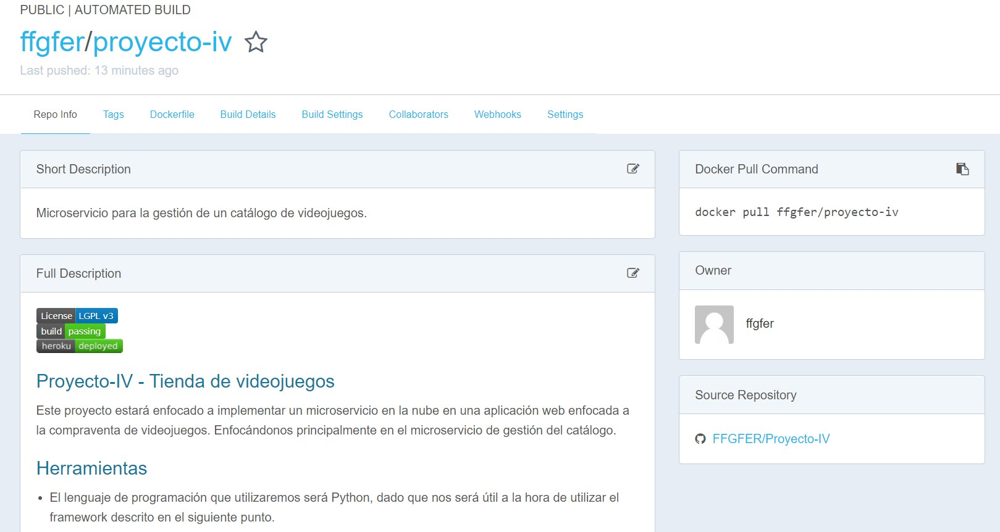
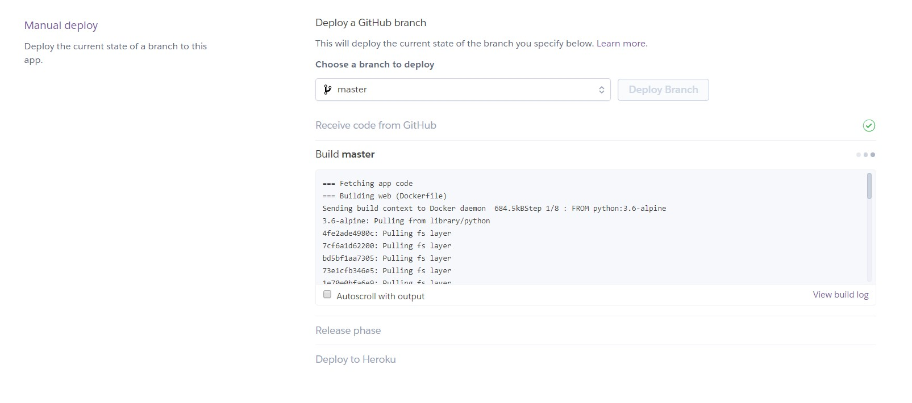
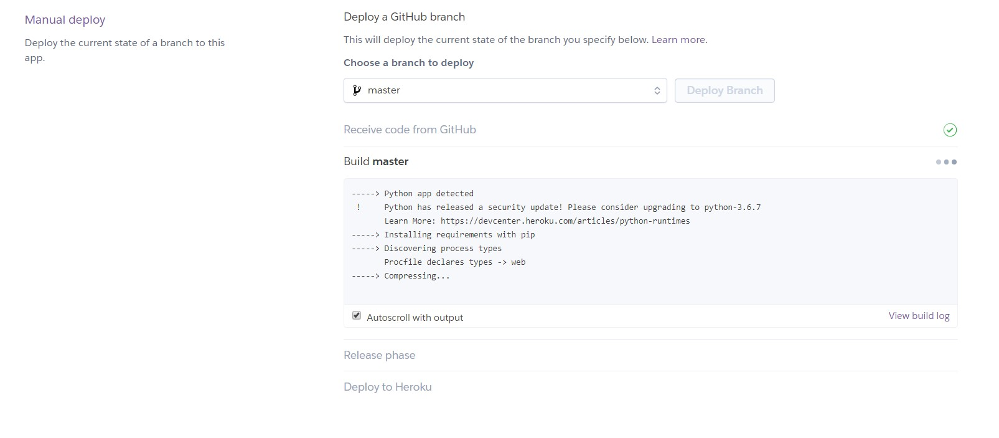

# Uso de contenedores

## Paso 1: Desinstalamos antiguas versiones de docker en caso de tenerla instaladas.
> sudo apt-get remove docker docker-engine docker.io

## Paso 2: Instalamos Docker
> sudo apt-get update

> sudo apt-get install apt-transport-https ca-certificates curl software-properties-common

> curl -fsSL https://download.docker.com/linux/ubuntu/gpg | sudo apt-key add -

> sudo apt-key fingerprint 0EBFCD88

> sudo add-apt-repository \
   "deb [arch=amd64] https://download.docker.com/linux/ubuntu \
   $(lsb_release -cs) \
   stable"
   
> sudo apt-get update

> sudo apt-get install docker-ce

## Paso 3: Verificamos que Docker funciona correctamente
> sudo docker run hello-world

## Paso 4: Configuramos Dockerfile:
Podemos ver el contenido del mismo aquí: [Dockerfile](https://github.com/FFGFER/Proyecto-IV/blob/master/Dockerfile)

Hemos usado una imagen liviana de python 3 (indicada en la línea 1). En la línea 3 indicamos nuestra identidad.
En las líneas 7 y 8 obtenemos el archivo requirements e instalamos las dependencias en nuestra imagen. 
Por último, en las líneas restantes obtenemos el contenido de todo el repositorio, nos vamos a la carpeta src/ y lanzamos la API con gunicorn.

## Paso 5: Nos registramos en Docker Hub y lo configuramos para que se genere un contenedor de nuestro proyecto cada vez que se haga un push al repositorio de GitHub.
En primer lugar "linkeamos" nuestra cuenta de Docker Hub con la de GitHub

Acto seguido, creamos y configuramos el repositorio en Docker Hub

## Paso 6: Despliegue en Heroku
Creamos el archivo [heroku.yml](https://github.com/FFGFER/Proyecto-IV/blob/master/heroku.yml) y lo subimos al repositorio.

Creamos la app en Heroku en la que desplegaremos nuestro contenedor
> heroku apps:create --region eu docker-tienda-vg

> heroku stack:set container

> git push heroku master

Como podemos observar, cuando hacemos el deploy del proyecto sin contenedores se fija en el Procfile:

Cuando desplegamos el contenedor, usa el heroku.yml que a su vez usa el Dockerfile:

