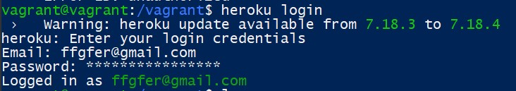
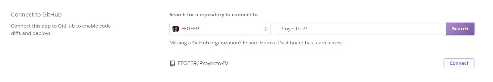
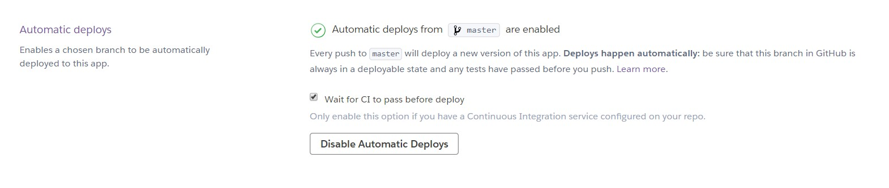

# Despliegue
Para desplegar nuestra aplicación en Heroku hemos seguido los siguientes pasos:

## Paso 1
Nos registramos en Heroku a través de su página web: [https://www.heroku.com/](https://www.heroku.com/)

## Paso 2
Iniciamos sesión en Heroku a través de la terminal:
> heroku login


## Paso 3
Creamos la aplicación en heroku mediante el comando siguiente:
> heroku apps:create --region eu tienda-vg


## Paso 4
Conectamos la aplicación de Heroku con nuestro repositorio de GitHub, esto se puede hacer en la sección Deploy del menú de la app en la página web de Heroku:


## Paso 5
Activamos el despliegue automático, así con cada push que hagamos a nuestro repositorio, se actualizará la build del despliegue (en caso de que nuestro commit pase los tests que tengamos configurados en nuestra integración continua):

