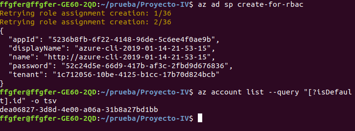

# Despliegue en la nube

Para desplegar nuestra aplicación en Azure, "orquestando" con Vagrant, provisionando con Ansible y desplegando con Fabric, hemos seguido los siguientes pasos:

## Paso 1: Configuración de azure

Instalamos azure-cli siguiendo los siguientes pasos ([https://docs.microsoft.com/en-us/cli/azure/install-azure-cli-apt?view=azure-cli-latest](https://docs.microsoft.com/en-us/cli/azure/install-azure-cli-apt?view=azure-cli-latest)):

> sudo apt-get install apt-transport-https lsb-release software-properties-common dirmngr -y

> AZ_REPO=$(lsb_release -cs)
echo "deb [arch=amd64] https://packages.microsoft.com/repos/azure-cli/ $AZ_REPO main" | \
    sudo tee /etc/apt/sources.list.d/azure-cli.list

> sudo apt-key --keyring /etc/apt/trusted.gpg.d/Microsoft.gpg adv \
     --keyserver packages.microsoft.com \
     --recv-keys BC528686B50D79E339D3721CEB3E94ADBE1229CF

> sudo apt-get update

> sudo apt-get install azure-cli

> az login

# Paso 2: Creamos el playbook de ansible y configuramos ansible correctamente:

El archivo de provisionaniento lo podemos encontrar en el directorio provision de la raíz del proyecto: [provision.yml](https://github.com/FFGFER/Proyecto-IV/blob/master/provision/provision.yml)

Con él instalamos git, python y pip en la máquina virtual que crearemos posteriormente.

No debemos olvidar añadir al archivo /etc/ansible/hosts la dirección DNS de nuestra máquina, en nuestro caso añadiremos:

~~~

[azure]
tiendavg.westeurope.cloudapp.azure.com

~~~

Ese nombre de dominio cobrará su sentido una vez configuremos el Vagrantfile en el siguiente paso.

Importante indicar en el archivo provision.yml en el campo host el valor azure, para aplicar los comandos indicados a las máquinas indicadas en el grupo azure del inventario de hosts de ansible.

## Paso 3: Creamos el Vagrantfile para configurar la máquina virtual alojada en Azure 

El contenido de nuestro Vagrantfile y que aspectos configura los podemos observar en los comentarios dentro del propio Vagrantfile, que se encuentra en la raíz del proyecto:

[Vagrantfile](https://github.com/FFGFER/Proyecto-IV/blob/master/Vagrantfile)

Para confeccionar dicho Vagrantfile nos hemos apoyado en la documentación del plugin vagrant-azure ([https://github.com/Azure/vagrant-azure](https://github.com/Azure/vagrant-azure)), copiando el ejemplo que se expone en dicha documentación para crear una máquina virtual en azure de la manera que buscamos rápidamente y adaptándolo con algunas adiciones adicionales para configurar ciertos aspectos de azure y para el provisionamiento mediante ansible. También nos hemos ayudado de información encontrada por la red como por ejemplo [https://github.com/ansible/ansible/issues/37221](https://github.com/ansible/ansible/issues/37221) y [https://www.vagrantup.com/docs/provisioning/ansible.html](https://www.vagrantup.com/docs/provisioning/ansible.html)

Como observaremos en la construcción del script de instalación, nos ayudaremos de él para usar vagrant junto con azure para la orquestación de la máquina virtual que allí alojaremos.

Para obtener el valor adecuado para esas variables de entorno deberemos ejecutar los siguientes comandos:

> az ad sp create-for-rbac

> az account list --query "[?isDefault].id" -o tsv

La actualización de las variables de entorno se hacen de manera muy sencilla:

> export ENVAR="valor"

Con la obtención de los valores, solo falta saber la correspondencia de cada dato con su correspondiente variable de entorno.

AZURE_TENANT_ID adquiere el valor del campo tenant, A
CoZURE_CLIENT_ID el del campo appId, AZURE_CLIENT_SECRET el del campo password, y AZURE_SUBSCRIPTION_ID el obtenido al ejecutar el comando "az account list --query "[?isDefault].id" -o tsv".

## Paso 4: Creamos el fabfile.py de Fabric para realizar el despliegue:

Nuestro [fabfile.py](https://github.com/FFGFER/Proyecto-IV/blob/master/fabfile.py) como se puede observar en su contenido tiene varias funciones definidas, una para clonar el repositorio del proyecto, otro para instalar las dependencias, otro para desplegarlo con gunicorn, otro para parar el servicio gunicorn en un momento dado, otro para borrar el repositorio de la máquina y otro para actualizar el repositorio.

También se puede observar la existencia de una función que engloba varias de las anteriores funciones, básicamente descarga el repositorio, instala las dependencias y despliega el proyecto directamente sin tener que ejecutar las funciones una a una por separado.

## Paso 5: Configuramos un Makefile en la raíz del proyecto

Este [script](https://github.com/FFGFER/Proyecto-IV/blob/master/Makefile) nos dinamizará el despliegue del proyecto en la nube.

Si analizamos, se ayuda de las funciones de Fabric configuradas anteriormente, pero la más importante es la orden install, que crea con un solo make install la máquina virtual en azure, descarga en la misma el repositorio y las dependencias del proyecto, y finalmente lo despliega.
